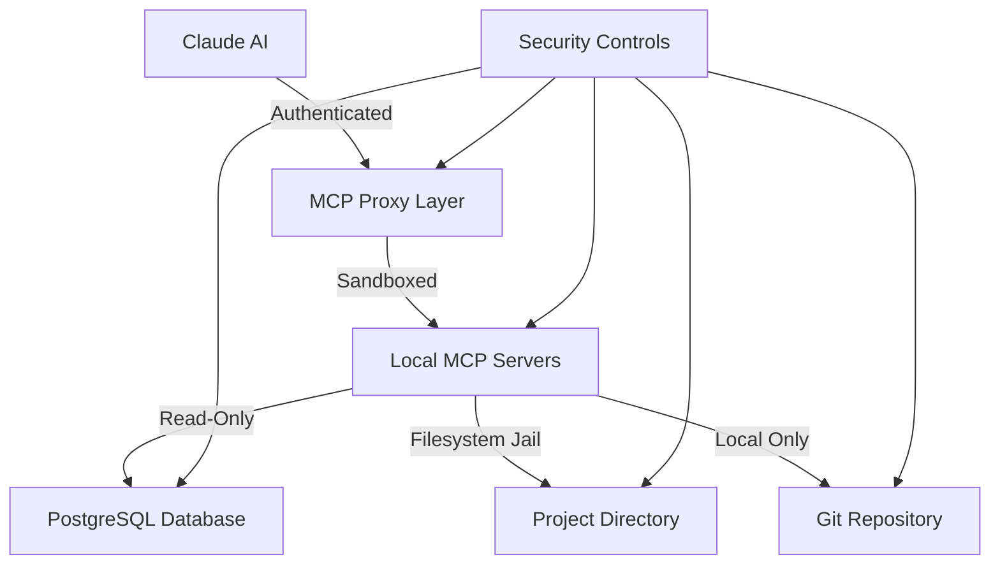

# MCP Security Guidelines and Access Controls

**Document Version**: 1.0  
**Last Updated**: December 27, 2025  
**Security Classification**: Internal Use  
**Related**: [GitHub Issue #45](https://github.com/RobeHGC/chatbot_nadia/issues/45)

## 📋 Overview

This document establishes comprehensive security guidelines, access controls, and best practices for the Model Context Protocol (MCP) debugging system in the NADIA project. All team members with MCP access must read and comply with these security requirements.

## 🛡️ Security Architecture

### **Defense in Depth Model**

The MCP system implements multiple layers of security:

1. **Access Control Layer**: Permission-based function access
2. **Network Security Layer**: Local-only connections and sandboxing
3. **Application Security Layer**: Read-only operations and input validation
4. **Data Security Layer**: Sensitive data exclusion and audit logging
5. **Operational Security Layer**: Monitoring and incident response

### **Security Boundaries**



## 🔐 Access Control Framework

### **Permission Matrix**

| MCP Server | Function | Permission Level | Risk Level | Monitoring |
|------------|----------|-----------------|------------|------------|
| postgres-nadia | `query` | Read-Only | Medium | Full Logging |
| filesystem-nadia | `read_file` | Read-Only | Low | Access Logging |
| filesystem-nadia | `search_files` | Read-Only | Low | Pattern Logging |
| filesystem-nadia | `list_directory` | Read-Only | Low | Path Logging |
| git-nadia | All Operations | Read-Only | Low | Command Logging |
| puppeteer-nadia | Browser Control | Limited Write | High | Full Recording |

### **Authentication and Authorization**

#### **Claude Settings Configuration**
```json
{
  "mcpServers": {
    "postgres-nadia": {
      "command": "npx",
      "args": ["@modelcontextprotocol/server-postgres", "postgresql:///nadia_hitl"],
      "permissions": ["read"],
      "sandbox": true,
      "timeout": 30000
    },
    "filesystem-nadia": {
      "command": "npx",
      "args": ["@modelcontextprotocol/server-filesystem", "/home/rober/projects/chatbot_nadia"],
      "permissions": ["read"],
      "jail": "/home/rober/projects/chatbot_nadia",
      "excludes": ["*.env", "*.key", "*.pem", "*.secret"]
    },
    "git-nadia": {
      "command": "python",
      "args": ["-m", "mcp_server_git", "--repository", "/home/rober/projects/chatbot_nadia"],
      "permissions": ["read"],
      "sandbox": true
    }
  },
  "security": {
    "auditLog": true,
    "rateLimiting": true,
    "allowedOperations": ["read", "query", "browse"]
  }
}
```

#### **Role-Based Access Control (RBAC)**

**Developer Role** (Default)
- Read access to all MCP servers
- Query execution on development database
- File system browsing within project scope
- Git repository analysis

**Senior Developer Role** (Extended)
- All Developer permissions
- Performance analysis queries
- Advanced debugging operations
- UI testing automation

**Admin Role** (Restricted)
- All permissions with oversight
- Security audit capabilities
- MCP server configuration changes
- Emergency procedures access

## 🚫 Security Restrictions

### **Prohibited Operations**

#### **Database Security**
```sql
-- ❌ NEVER ALLOWED
INSERT, UPDATE, DELETE, DROP, ALTER, CREATE, GRANT, REVOKE
TRUNCATE, COPY, BULK OPERATIONS, ADMINISTRATIVE FUNCTIONS

-- ❌ PROHIBITED QUERIES
SELECT * FROM users WHERE password IS NOT NULL;
SELECT api_key, secret_key FROM configuration;
COPY (SELECT * FROM sensitive_table) TO '/tmp/export.csv';

-- ✅ ALLOWED QUERIES
SELECT user_id, message_count FROM user_stats LIMIT 100;
EXPLAIN ANALYZE SELECT * FROM messages WHERE created_at > NOW() - INTERVAL '1 hour';
SELECT COUNT(*) FROM recovery_requests WHERE status = 'PENDING';
```

#### **Filesystem Security**
```bash
# ❌ NEVER ACCESS
~/.env, .env.local, .env.production
*.key, *.pem, *.p12, *.pfx
config/secrets.yml, credentials.json
/etc/passwd, /home/*/.ssh/

# ❌ PROHIBITED PATTERNS  
/proc/, /sys/, /dev/
/var/log/auth.log, /var/log/secure
~/.aws/, ~/.gcp/, ~/.ssh/

# ✅ ALLOWED ACCESS
/home/rober/projects/chatbot_nadia/**/*.py
/home/rober/projects/chatbot_nadia/**/*.js
/home/rober/projects/chatbot_nadia/**/*.md
/home/rober/projects/chatbot_nadia/logs/*.log (read-only)
```

#### **Git Security**
```bash
# ❌ NEVER ALLOWED
git push, git commit, git merge, git rebase --interactive
git config --global user.email, git config --global user.name
git remote add, git remote set-url

# ✅ ALLOWED OPERATIONS
git log, git show, git diff, git blame
git status (read-only), git branch (list only)
git grep, git log --grep, git log --author
```

### **Data Classification and Handling**

#### **Confidential Data (No Access)**
- API keys and secrets
- User passwords and authentication tokens
- Personal identifiable information (PII)
- Production database credentials
- Third-party service credentials

#### **Internal Data (Restricted Access)**
- Development database content
- Application logs and debugging information
- Configuration files (non-sensitive)
- Code repository history

#### **Public Data (Open Access)**
- Documentation and README files
- Public configuration examples
- Open source dependencies
- Non-sensitive project files

## 🔍 Monitoring and Audit

### **Comprehensive Logging**

All MCP operations are logged with the following information:
- Timestamp (UTC)
- User/Session identifier
- MCP server and function called
- Parameters passed (sanitized)
- Response status and size
- Execution time
- Source IP (if applicable)

#### **Log Format**
```json
{
  "timestamp": "2025-12-27T12:30:45.123Z",
  "session_id": "claude_session_abc123",
  "mcp_server": "postgres-nadia",
  "function": "query",
  "parameters": {
    "sql": "SELECT COUNT(*) FROM messages WHERE created_at > ?",
    "params_count": 1
  },
  "execution_time_ms": 245,
  "response_size_bytes": 156,
  "status": "success",
  "risk_level": "low"
}
```

### **Security Monitoring**

#### **Real-time Alerts**
```yaml
# Monitoring Rules
alerts:
  - name: "MCP Suspicious Query"
    condition: "sql CONTAINS 'password' OR sql CONTAINS 'secret'"
    severity: "CRITICAL"
    action: "BLOCK_AND_ALERT"
    
  - name: "MCP Sensitive File Access"
    condition: "path CONTAINS '.env' OR path CONTAINS '.key'"
    severity: "HIGH"
    action: "BLOCK_AND_LOG"
    
  - name: "MCP Rate Limit Exceeded"
    condition: "requests_per_minute > 100"
    severity: "MEDIUM"
    action: "THROTTLE_AND_LOG"
    
  - name: "MCP Large Query Result"
    condition: "response_size_bytes > 10485760"  # 10MB
    severity: "LOW"
    action: "LOG_ONLY"
```

#### **Security Dashboards**
- MCP access patterns and anomalies
- Failed access attempts and blocked operations
- Resource usage and performance metrics
- Security rule violations and responses

### **Incident Response**

#### **Security Event Classification**

**Critical (P0)**
- Attempted access to production systems
- Exposure of secrets or API keys
- Successful privilege escalation
- Evidence of data exfiltration

**High (P1)**
- Multiple failed authentication attempts
- Access to sensitive development data
- Unusual query patterns indicating reconnaissance
- Violation of data access policies

**Medium (P2)**
- Rate limiting triggers
- Access to restricted file types
- Performance anomalies suggesting abuse
- Policy violations without data exposure

**Low (P3)**
- Expected security rule triggers
- Performance monitoring events
- Routine access pattern variations
- Educational/training violations

#### **Response Procedures**

**Immediate Response (0-15 minutes)**
```bash
# Disable MCP access immediately
echo '{"mcpServers": {}}' > ~/.claude/settings.local.json.disabled
cp ~/.claude/settings.local.json.disabled ~/.claude/settings.local.json

# Capture forensic evidence
cp ~/.claude/logs/mcp.log /secure/forensics/mcp-incident-$(date +%Y%m%d-%H%M%S).log
ps aux | grep mcp > /secure/forensics/mcp-processes-$(date +%Y%m%d-%H%M%S).log

# Alert security team
curl -X POST "$SECURITY_WEBHOOK" -d "{\"alert\": \"MCP Security Incident\", \"timestamp\": \"$(date -u)\"}"
```

**Investigation Phase (15 minutes - 4 hours)**
- Analyze MCP access logs for breach scope
- Review database query logs for sensitive data access
- Check filesystem access patterns for data exfiltration
- Identify affected systems and potential data exposure

**Recovery Phase (4-24 hours)**
- Implement corrective security measures
- Reset access credentials if compromised
- Update security rules and monitoring
- Restore secure MCP operations with enhanced controls

## 🏗️ Security Architecture Best Practices

### **Secure Configuration Management**

#### **Configuration Validation**
```bash
#!/bin/bash
# MCP Security Configuration Validator

echo "=== MCP Security Configuration Audit ==="

# Check for secure MCP server configuration
if [ -f ~/.claude/settings.local.json ]; then
    echo "✓ Claude settings file exists"
    
    # Validate no production database connections
    if grep -q "postgresql://.*production" ~/.claude/settings.local.json; then
        echo "❌ CRITICAL: Production database connection detected!"
        exit 1
    else
        echo "✓ No production database connections found"
    fi
    
    # Validate filesystem jail configuration
    if jq -r '.mcpServers["filesystem-nadia"].jail' ~/.claude/settings.local.json | grep -q "/home/rober/projects/chatbot_nadia"; then
        echo "✓ Filesystem jail properly configured"
    else
        echo "⚠️  WARNING: Filesystem jail not properly configured"
    fi
    
    # Check for sensitive file exclusions
    if jq -r '.mcpServers["filesystem-nadia"].excludes[]' ~/.claude/settings.local.json | grep -q "\.env"; then
        echo "✓ Sensitive file exclusions configured"
    else
        echo "⚠️  WARNING: Sensitive file exclusions missing"
    fi
else
    echo "❌ CRITICAL: Claude settings file not found!"
    exit 1
fi

echo "=== Security Audit Complete ==="
```

### **Network Security**

#### **Connection Security**
- All MCP servers run locally only (localhost/127.0.0.1)
- No external network connections permitted
- Unix domain sockets preferred over TCP where possible
- TLS encryption for any network communication

#### **Process Isolation**
```bash
# Run MCP servers with restricted privileges
systemd-run --user --scope --property=PrivateNetwork=true \
  --property=ProtectHome=read-only \
  --property=ProtectSystem=strict \
  npx @modelcontextprotocol/server-postgres postgresql:///nadia_hitl
```

### **Data Protection**

#### **Encryption at Rest**
- Database connections use encrypted storage
- Log files rotated and compressed with encryption
- Temporary files cleaned up automatically
- No sensitive data persisted to disk

#### **Encryption in Transit**
- Local connections use secure protocols
- Inter-process communication encrypted
- No plaintext transmission of sensitive data
- Certificate validation for external dependencies

## 📋 Compliance and Governance

### **Security Policies**

#### **Data Access Policy**
1. **Least Privilege**: Grant minimum necessary access only
2. **Need to Know**: Access limited to job function requirements
3. **Time-Limited**: Regular review and renewal of access permissions
4. **Audit Trail**: All access logged and reviewable

#### **Incident Management Policy**
1. **Detection**: Automated monitoring and alerting
2. **Response**: Defined procedures and escalation paths
3. **Recovery**: Tested backup and restore procedures
4. **Learning**: Post-incident review and improvement

### **Regular Security Reviews**

#### **Weekly Security Checks**
```bash
#!/bin/bash
# Weekly MCP Security Review

# Check for new sensitive files
find /home/rober/projects/chatbot_nadia -name "*.env*" -o -name "*.key" -o -name "*secret*" | \
  while read file; do
    echo "SENSITIVE FILE: $file"
    ls -la "$file"
  done

# Review MCP access logs
tail -1000 ~/.claude/logs/mcp.log | grep -E "(password|secret|key|token)" | head -10

# Check database for new sensitive tables
psql postgresql://localhost/nadia_hitl -c "
SELECT table_name 
FROM information_schema.tables 
WHERE table_name LIKE '%secret%' 
   OR table_name LIKE '%password%' 
   OR table_name LIKE '%token%';"

echo "Weekly security review complete"
```

#### **Monthly Security Audit**
- Review all MCP access permissions
- Audit security logs for anomalies
- Test incident response procedures
- Update security documentation
- Training and awareness updates

#### **Quarterly Security Assessment**
- Comprehensive penetration testing
- Third-party security review
- Compliance validation
- Security architecture review
- Risk assessment update

## 🎓 Security Training

### **Required Training for MCP Users**

#### **Initial Certification**
1. **Security Fundamentals** (2 hours)
   - Understanding MCP security model
   - Data classification and handling
   - Access control principles
   - Incident response procedures

2. **Hands-On Workshop** (2 hours)
   - Secure MCP configuration
   - Safe query practices
   - Recognizing security violations
   - Proper escalation procedures

3. **Certification Exam** (30 minutes)
   - 20 questions covering security policies
   - Practical scenario responses
   - Minimum 85% passing score
   - Annual recertification required

#### **Ongoing Education**
- Monthly security awareness briefings
- Quarterly hands-on workshops
- Annual security policy updates
- Incident response drills

### **Security Champions Program**

Designated security champions in each team:
- Advanced security training
- Security policy development input
- Incident response leadership
- Peer education and mentoring

## 📊 Security Metrics

### **Key Performance Indicators (KPIs)**

#### **Access Control Metrics**
- Authentication success/failure rates
- Privilege escalation attempts
- Policy violation incidents
- Access review completion rates

#### **Monitoring Effectiveness**
- Security event detection time
- False positive/negative rates
- Incident response time
- Security tool coverage

#### **Training and Awareness**
- Training completion rates
- Certification pass rates
- Security knowledge assessments
- Phishing simulation results

### **Security Dashboards**

Real-time monitoring dashboards showing:
- Current MCP server status and health
- Active security rules and violations
- Access patterns and anomalies
- Incident status and resolution

## 🚀 Future Security Enhancements

### **Planned Improvements**

#### **Enhanced Authentication**
- Multi-factor authentication for MCP access
- Certificate-based authentication
- Session token management
- Biometric authentication integration

#### **Advanced Monitoring**
- Machine learning anomaly detection
- Behavioral analysis and profiling
- Automated threat response
- Integration with SIEM systems

#### **Zero Trust Architecture**
- Continuous verification of access
- Micro-segmentation of MCP services
- Dynamic policy enforcement
- Risk-based access controls

## 📞 Security Contacts

### **Emergency Response**
- **Security Team**: security@nadia-project.com
- **Incident Response**: +1-xxx-xxx-xxxx
- **After Hours**: on-call rotation

### **Regular Security Support**
- **Security Architecture**: Lead Security Engineer
- **Compliance**: Compliance Officer
- **Training**: Security Training Coordinator

---

**Security Classification**: Internal Use  
**Document Owner**: Security Team  
**Review Cycle**: Quarterly  
**Next Review**: March 27, 2026

**This document contains security-sensitive information. Distribution is restricted to authorized personnel only.**