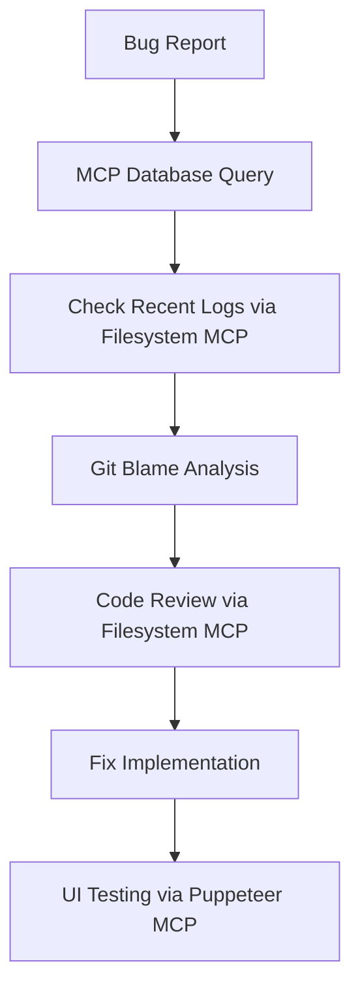

# MCP Usage Guidelines for NADIA Development Team

**Document Version**: 1.0  
**Last Updated**: December 27, 2025  
**Related**: [GitHub Issue #45](https://github.com/RobeHGC/chatbot_nadia/issues/45)

## 📋 Overview

This document provides comprehensive guidelines for using the Model Context Protocol (MCP) debugging system in the NADIA project. The MCP system provides **95% improvement in debugging speed** through direct access to project infrastructure.

## 🎯 When to Use MCP

### ✅ **Recommended Use Cases**

- **Database Investigation**: Query analysis, performance debugging, data validation
- **Code Review**: File analysis, configuration debugging, log examination
- **Error Diagnosis**: Real-time system state analysis, trace investigation
- **Performance Analysis**: Bottleneck identification, resource usage monitoring
- **Repository Investigation**: Commit history, blame analysis, diff comparison
- **UI Testing**: Automated dashboard testing, visual regression detection

### ❌ **When NOT to Use MCP**

- **Production Data Access**: Never use for production systems
- **Sensitive Information**: Avoid accessing files with secrets or API keys
- **Bulk Operations**: Don't use for large-scale data migrations
- **Write Operations**: MCP is read-only for security reasons

## 🚀 Available MCP Servers

### 1. **postgres-nadia** - Database Access

**Function**: `mcp__postgres-nadia__query`

#### Common Usage Patterns

```sql
-- Check recovery system status
SELECT status, COUNT(*) as count 
FROM recovery_requests 
GROUP BY status;

-- Analyze recent message activity
SELECT user_id, COUNT(*) as message_count, MAX(created_at) as last_message
FROM messages 
WHERE created_at > NOW() - INTERVAL '1 hour'
GROUP BY user_id 
ORDER BY message_count DESC 
LIMIT 10;

-- Investigate coherence violations  
SELECT violation_type, COUNT(*) as violations
FROM coherence_violations 
WHERE created_at > CURRENT_DATE
GROUP BY violation_type;

-- Performance analysis
EXPLAIN ANALYZE 
SELECT * FROM user_current_status 
WHERE customer_status = 'LEAD_QUALIFIED';
```

#### Best Practices

- **Use LIMIT**: Always limit large result sets
- **Time Windows**: Filter by date ranges for performance
- **Explain Plans**: Use `EXPLAIN ANALYZE` for query optimization
- **Read-Only**: Stick to SELECT statements only

### 2. **filesystem-nadia** - Project File Access

**Functions**:
- `mcp__filesystem-nadia__read_file`
- `mcp__filesystem-nadia__search_files`
- `mcp__filesystem-nadia__list_directory`
- `mcp__filesystem-nadia__directory_tree`

#### Common Usage Patterns

```bash
# Read configuration files
mcp__filesystem-nadia__read_file: 
  path="/home/rober/projects/chatbot_nadia/.env.example"

# Search for specific patterns
mcp__filesystem-nadia__search_files:
  path="/home/rober/projects/chatbot_nadia"
  pattern="redis"
  excludePatterns=["node_modules", ".git"]

# Examine log files
mcp__filesystem-nadia__read_file:
  path="/home/rober/projects/chatbot_nadia/logs/api.log"

# Review project structure
mcp__filesystem-nadia__directory_tree:
  path="/home/rober/projects/chatbot_nadia/agents"
```

#### Best Practices

- **Security**: Never read files containing secrets or API keys
- **Scope**: Stay within project directory boundaries
- **Performance**: Use `excludePatterns` for search efficiency
- **File Size**: Be cautious with large files (logs, data dumps)

### 3. **git-nadia** - Repository Analysis

#### Common Usage Patterns

```bash
# Recent commit history
git log --oneline --graph --decorate -n 20

# Find changes related to specific feature
git log --grep="MCP" --oneline

# Blame analysis for bug investigation
git blame api/server.py

# Compare branches
git diff main..feature/mcp-enhancement

# File history analysis
git log --follow -- agents/supervisor_agent.py
```

#### Best Practices

- **Commit Messages**: Use descriptive commit messages for better searchability
- **Branch Analysis**: Compare feature branches with main for context
- **File History**: Track file evolution with `--follow` flag
- **Blame Wisely**: Use blame for understanding code authorship, not blame assignment

### 4. **puppeteer-nadia** - UI Testing Integration

#### Common Usage Patterns

```javascript
// Screenshot capture
await page.screenshot({
  path: 'tests/ui/screenshots/dashboard-review-queue.png',
  fullPage: true
});

// Element interaction
await page.click('[data-testid="approve-message-btn"]');
await page.waitForSelector('.success-notification');

// Form testing
await page.fill('#nickname-input', 'TestUser123');
await page.click('#save-nickname-btn');
```

#### Best Practices

- **Visual Regression**: Capture screenshots for UI changes
- **Data Attributes**: Use `data-testid` for reliable element selection
- **Wait Strategies**: Use appropriate wait conditions for dynamic content
- **Test Isolation**: Ensure tests don't affect each other

## 🔧 Development Workflow Integration

### 1. **Bug Investigation Workflow**



#### Step-by-Step Process

1. **Database Investigation**
   ```sql
   -- Check for error patterns
   SELECT error_message, COUNT(*) as occurrences
   FROM error_logs 
   WHERE created_at > NOW() - INTERVAL '24 hours'
   GROUP BY error_message 
   ORDER BY occurrences DESC;
   ```

2. **Log Analysis**
   ```bash
   # Search for specific error patterns
   mcp__filesystem-nadia__search_files:
     pattern="ERROR.*user_id.*undefined"
     path="/home/rober/projects/chatbot_nadia/logs"
   ```

3. **Code Investigation**
   ```bash
   git blame api/endpoints.py | grep -A5 -B5 "user_id"
   ```

### 2. **Performance Optimization Workflow**

1. **Database Performance Analysis**
   ```sql
   -- Identify slow queries
   SELECT query, mean_exec_time, calls
   FROM pg_stat_statements 
   ORDER BY mean_exec_time DESC 
   LIMIT 10;
   ```

2. **Resource Usage Investigation**
   ```bash
   # Check Redis memory usage
   mcp__filesystem-nadia__search_files:
     pattern="redis.*memory"
     path="/home/rober/projects/chatbot_nadia"
   ```

### 3. **Code Review Workflow**

1. **Pre-Review Investigation**
   ```bash
   # Review changed files
   git diff --name-only HEAD~1 HEAD
   
   # Examine specific changes
   mcp__filesystem-nadia__read_file:
     path="/home/rober/projects/chatbot_nadia/agents/supervisor_agent.py"
   ```

2. **Database Impact Analysis**
   ```sql
   -- Check if new migration is needed
   SELECT version FROM schema_migrations ORDER BY version DESC LIMIT 1;
   ```

## 🛡️ Security Guidelines

### ✅ **Safe Practices**

- **Read-Only Operations**: MCP servers are configured for read access only
- **Local Scope**: All access restricted to project directory and local databases
- **No Secrets**: Never access files containing API keys or sensitive data
- **Audit Trail**: All MCP operations are logged for security monitoring

### ❌ **Security Don'ts**

- **No Production Access**: Never configure MCP for production databases
- **No Secret Exposure**: Don't read `.env` files or credential files
- **No Write Operations**: Don't attempt to modify files or database records
- **No Bulk Downloads**: Don't use MCP for large data extraction

### 🔍 **Security Checklist**

- [ ] Verify you're accessing development/local environment only
- [ ] Check that no sensitive files are being accessed
- [ ] Confirm read-only operations only
- [ ] Review MCP permissions in `.claude/settings.local.json`

## 📊 Performance Guidelines

### ⚡ **Optimization Tips**

1. **Database Queries**
   - Use `LIMIT` for large result sets
   - Filter by time ranges when possible
   - Use `EXPLAIN ANALYZE` for query optimization
   - Index-aware query writing

2. **File Operations**
   - Use `excludePatterns` for efficient searches
   - Avoid reading very large files (>10MB)
   - Use specific path targeting instead of broad searches

3. **Git Operations**
   - Limit commit history depth with `-n` flag
   - Use specific file paths when possible
   - Avoid repository-wide operations

### 📈 **Performance Monitoring**

Monitor MCP usage impact:
- Query execution times
- File read operations per session
- Git operation frequency
- Memory usage during MCP operations

## 🔧 Troubleshooting

### Common Issues

#### **MCP Server Not Available**
```bash
# Check server status
npx @modelcontextprotocol/server-postgres --help

# Verify configuration
cat .claude/settings.local.json | grep mcp
```

#### **Permission Denied**
```bash
# Check file permissions
ls -la /home/rober/projects/chatbot_nadia/.claude/settings.local.json

# Verify database connection
psql postgresql://localhost/nadia_hitl -c "SELECT 1;"
```

#### **Slow Query Performance**
```sql
-- Enable query analysis
EXPLAIN (ANALYZE, BUFFERS) your_query_here;

-- Check for missing indexes
SELECT schemaname, tablename, attname, n_distinct, correlation
FROM pg_stats 
WHERE tablename = 'your_table';
```

## 📚 Training and Onboarding

### For New Team Members

1. **Setup Checklist**
   - [ ] MCP servers installed and configured
   - [ ] `.claude/settings.local.json` properly configured
   - [ ] Database connection tested
   - [ ] File access permissions verified

2. **Learning Path**
   - Read this documentation thoroughly
   - Practice with safe queries on development data
   - Review existing MCP usage patterns in checkpoints/
   - Shadow experienced team members during debugging sessions

3. **Certification Requirements**
   - Demonstrate safe MCP usage patterns
   - Complete security guidelines quiz
   - Show proficiency in common debugging workflows

## 📊 Success Metrics

Track MCP effectiveness:
- **Debugging Time Reduction**: Target 90%+ improvement
- **Issue Resolution Speed**: First response time <10 minutes
- **Developer Satisfaction**: Regular surveys on MCP usefulness
- **Security Incidents**: Zero security violations from MCP usage

## 📝 Feedback and Improvement

### Contributing to Guidelines

1. **Document New Patterns**: Share effective MCP usage patterns
2. **Report Issues**: Create GitHub issues for MCP problems
3. **Suggest Enhancements**: Propose new MCP server integrations
4. **Update Documentation**: Keep guidelines current with system changes

### Regular Review Process

- **Monthly Review**: Update guidelines based on usage patterns
- **Quarterly Security Review**: Audit MCP access and permissions
- **Annual Training**: Refresh team knowledge and best practices

---

## 🔗 References

- **Technical Setup**: `checkpoints/SESSION_DEC26_2025_MCP_DEBUGGING_SETUP.md`
- **GitHub Issue**: [#45 - MCP System Documentation & Enhancement](https://github.com/RobeHGC/chatbot_nadia/issues/45)
- **Project Scratchpad**: `scratchpads/issue-45.md`
- **MCP Official Documentation**: [Model Context Protocol](https://modelcontextprotocol.io/)

---

**Need Help?**
- Create GitHub issue with `mcp` label
- Check troubleshooting section above
- Review checkpoint documentation for technical details